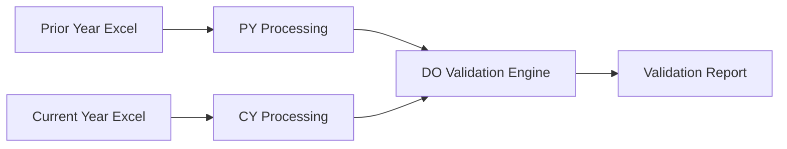

# Power Query Analysis Summary

## Overview
This document summarizes the Power Query transformations found in three .txt files that form the foundation for the DHS advance payment analysis system. These queries process financial data to track, validate, and report on government advance payments across fiscal years.

## File Structure and Relationships

### 1. CY 4-Advance Analysis.txt (Current Year Processing)
**Purpose**: Processes current fiscal year advance payment data with comprehensive business logic calculations.

**Key Transformations**:
- **Data Source**: Excel file from CWMD Q3 FY24
- **Initial Cleanup**: 
  - Removes header rows (top 9)
  - Promotes row 10 as column headers
  - Removes extraneous columns (Column17-24)
  - Filters for non-null TAS values

**Critical Business Fields Created**:
1. **DO Concatenate**: `TAS + DHS Doc No + Advance/Prepayment` - Unique identifier for joining
2. **PoP Expired?**: Boolean flag checking if Period of Performance End Date < Today
3. **Days Since PoP Expired**: Calculated only if expired > 720 days
4. **Invoiced Within Last 12 Months**: Checks if Last Activity Date within 365 days
5. **Active/Inactive Advance**: Categorization based on invoice activity
6. **Abnormal Balance**: Component-specific logic:
   - WMD: Balance < $10,000
   - Non-WMD: Balance < $100,000
7. **CY Advance?**: Flags if advance created in current fiscal year

### 2. PY 4-Advance Analysis.txt (Prior Year Processing)
**Purpose**: Loads prior year data as reference for comparison and validation.

**Key Characteristics**:
- **Data Source**: Excel file from CWMD Q2 FY24 (one quarter earlier)
- **Minimal Processing**: Only essential transformations
- **Primary Function**: Provides baseline data for year-over-year comparisons
- Creates matching **DO Concatenate** field for joining with CY data

### 3. DO 4-Advance Analysis.txt (Validation and Reporting)
**Purpose**: Performs comprehensive validation by joining CY and PY data.

**Complex Validation Rules**:

#### Status Tracking
- **Status 1**: Active advances requiring ongoing monitoring
- **Status 2**: Advances pending liquidation

#### Key Validation Columns Created:
1. **Advances Requiring Explanations?**: Multi-condition logic checking:
   - Balance thresholds
   - Invoice activity
   - Period of performance status
   - Abnormal balances

2. **Null or Blank Columns**: Identifies missing required fields:
   - Component
   - Advance Status
   - TAS
   - DHS Doc No
   - Date of Advance
   - Period of Performance End Date
   - Anticipated Liquidation Date (for Status 2)

3. **Status Changed?**: Tracks changes from PY to CY

4. **Anticipated Liquidation Date Test**: Validates Status 2 liquidation dates

5. **DO Status 1/2 Validations**: 
   - 50+ conditional rules for Status 1
   - 40+ conditional rules for Status 2
   - Generates detailed validation messages

## Data Flow Architecture

## Business Logic Patterns

### 1. Component-Specific Logic
- **WMD (Weapons of Mass Destruction)**: Special abnormal balance threshold ($10,000)
- **Non-WMD Components**: Standard threshold ($100,000)

### 2. Time-Based Validations
- Invoice activity within 12 months
- Period of Performance expiration tracking
- Days since expiration calculations (720-day threshold)
- Anticipated liquidation date validations

### 3. Status-Based Rules
- **Status 1 (Active)**:
  - Must have recent invoice activity
  - Should not have expired PoP > 720 days
  - Requires explanation if balance is abnormal
  
- **Status 2 (Pending Liquidation)**:
  - Must have anticipated liquidation date
  - Different validation rules apply
  - Tracks progress toward liquidation

### 4. Data Quality Checks
- Null/blank field detection
- Cross-year consistency checks
- Logical validation (e.g., advance date vs. PoP dates)

## Key Findings for Python Implementation

### 1. Data Processing Requirements
- **Date Handling**: Multiple date columns requiring careful parsing
- **Text Processing**: Concatenation and string manipulation for identifiers
- **Conditional Logic**: Extensive if-then-else chains requiring clear implementation

### 2. Performance Considerations
- Large dataset processing (multiple Excel files)
- Complex joins on concatenated keys
- Multiple passes for validation logic

### 3. Output Requirements
- Detailed validation messages
- Multiple boolean flags
- Consolidated reporting columns

### 4. Business Rule Complexity
- 90+ individual validation rules
- Component-specific variations
- Time-sensitive calculations

## Recommendations for Python Implementation

1. **Use Pandas DataFrames** for Excel I/O and data manipulation
2. **Implement Validation Classes** to organize the complex rule sets
3. **Create Configuration Files** for thresholds and business rules
4. **Use Enum Classes** for status codes and validation types
5. **Implement Logging** for audit trails and debugging
6. **Design Modular Architecture** separating:
   - Data loading
   - Transformation logic
   - Validation rules
   - Report generation

## Critical Success Factors

1. **Maintain Data Integrity**: Preserve exact business logic from Power Query
2. **Handle Edge Cases**: Null values, missing dates, invalid statuses
3. **Performance Optimization**: Efficient processing of large datasets
4. **Clear Error Messages**: Match or improve upon Power Query validation messages
5. **Extensibility**: Design for easy rule modifications and additions